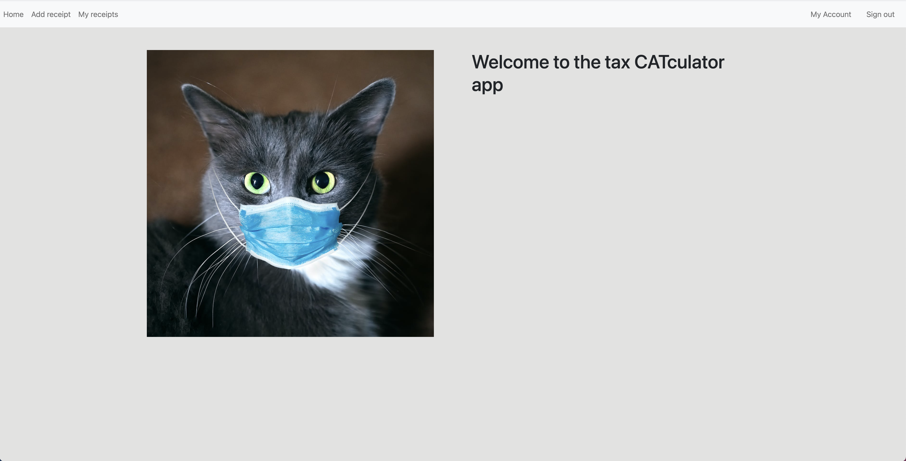

# Tax CATculator App

Tax CATculator is an app where you can login/signup and upload receipts in text files that will calculate the taxes and total amount you should pay for that receipt and store it on your account.



## Built With

- Ruby v3.0.1
- Ruby on Rails v6.1.4
- PostgreSQL

## Live Demo

[Live demo](https://tax-catculator.herokuapp.com/)

## Getting Started

To get a local copy up and running follow these simple example steps.

### Prerequisites

Ruby: 3.0.1  
Rails: 6.1.4  
Postgres: >=9.5  
Rspec gem

### Setup

> Clone the repository:

```
$ cd <folder>
```

```
$ git clone git@github.com:garciajordy/sales_tax_kata_advanced.git
```

```
$ cd sales_tax_kata_advanced
```

> Instal gems with:

```
$ bundle install
```

> Setup database with:

```
$ rails db:create
$ rails db:migrate
```

## Rspec testing

> To test all models, write the following in your terminal:

```
$ rspec spec/models
```

> To test all helpers, write the following in your terminal:

> You can do the same for all other directories by simply writing ```rspec spec/<folder>``` 

```
$ rspec spec/helpers
```
> To test all the specs simply write:
```
$ rspec
```

## Usage

Start server with:

```
$ rails server
```

Open `http://localhost:3000/` in your browser.

**Jordy Garcia**

- Github: [](https://github.com/garciajordy/)
- Linkedin: [](https://www.linkedin.com/in/jordygarcia/)
- Twitter: [](https://twitter.com/JordyGarcia1994)

## 🤝 Contributing

Contributions, issues, and feature requests are welcome!

Feel free to check the [issues page](https://github.com/garciajordy/sales_tax_kata_advanced/issues).

## Show your support

Give a ⭐️ if you like this project!

## Acknowledgments

- Hat tip to anyone whose code was used.
- Hat tip to the Nebulab academy.
- Hat tip to Stefano for all his work and effort.
